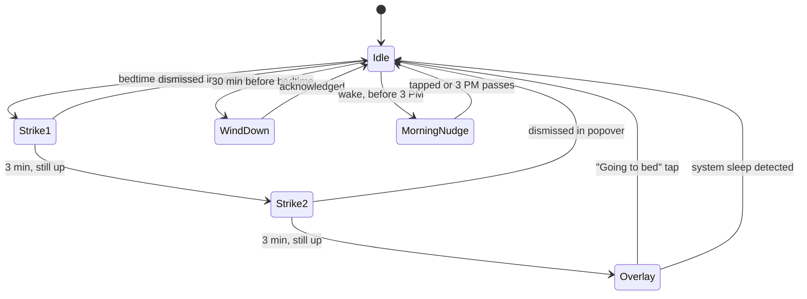

# Night Shepherd

A tiny menu-bar coach that forces your sleep cycle back into shape.

Built primarily by Claude + GPT-5.5 agents in a multi-agent run.

## What it does

- Escalating bedtime reminders: a gentle nudge, a firmer nudge, then a fullscreen overlay you cannot ignore.
- Strike-three intervention: if you keep dismissing reminders, the screen turns into a wall of dark and the quote of the night.
- Morning motivation before 3 PM: a sharper, intentionally awkward notification you have to actually read.
- Wind-down reminder thirty minutes before bedtime: lights down, phone away, tea on.
- Guaranteed in-app fallback banners with a soft sound when macOS suppresses system notification banners.
- Lives quietly in the macOS menu bar. No Dock icon, no window clutter.
- Roughly 30 MB of RAM at idle. Fully offline. No accounts. No telemetry.

## Requirements

- macOS 26 Tahoe or later.
- Apple Silicon Mac.
- Swift 6.3 toolchain, available through the Command Line Tools for Xcode. **No full Xcode install is required.**

Install the toolchain (if you do not already have it) with:

```bash
xcode-select --install
swift --version   # should report 6.3 or newer
```

## Build & run

From the workspace root:

```bash
cd time-habit-app
bash build.sh
open NightShepherd.app
```

The first launch will prompt for notification permission. Allow it. The popover that appears walks you through onboarding: pick a bedtime, a wake cutoff, and a wind-down offset, and you are done.

To install permanently:

```bash
cp -R NightShepherd.app /Applications/
```

Then open Night Shepherd, click the moon icon in the menu bar, open **Settings** (`Cmd+,`), and toggle **Launch at Login**. From this point on it will start with the system and stay out of your way.

## How the reminder cycle works

Night Shepherd uses a simple strike model. When your bedtime arrives, you get a notification. If you snooze or ignore it, three minutes later you get a firmer one. Three minutes after that, the entire screen takes over until you confirm you are heading to bed.



A cycle resets when any of these happen:

- You hit the **Dismiss** button in the menu-bar popover.
- macOS goes to sleep (lid close or idle).
- You tap a notification action on the bedtime alert.

The morning flow is independent: between your configured wake time and the **wake-quote cutoff** (default 3 PM), every login or unlock surfaces one short motivational notification. After the cutoff Night Shepherd goes silent until evening.

The wind-down flow fires once, 30 minutes before bedtime by default, with a single soft notification.

## Customising

Open the popover from the menu bar, then **Settings** (`Cmd+,`). Everything is configurable:

- **Bedtime** — when the strike cycle begins.
- **Wake time** and **wake-quote cutoff** — morning window for motivational nudges.
- **Wind-down offset** — minutes before bedtime that the wind-down reminder fires.
- **Escalation interval** — minutes between strikes (default 3).
- **Strikes before overlay** — how many escalations before the fullscreen takeover (default 2).
- **Launch at Login** — start with the system.

All settings persist immediately. There is no Save button.

## Privacy

- Fully offline. The app makes zero network requests.
- No analytics, no telemetry, no crash reporting.
- No file-system access beyond reading the bundled quote list.
- All settings are stored in `UserDefaults` under the app's own domain. Nothing leaves your machine.

## Author

Built by Ishaan Gupta — [github username placeholder]

## Troubleshooting

**Notifications don't appear.** Open System Settings → Notifications → Night Shepherd and confirm that **Allow Notifications**, **Banners**, and **Sounds** are enabled. The Focus modes panel can also silence them; check that Night Shepherd is allowed during your bedtime hours.

**Menu bar icon does not show up.** This usually means Launch Services has not registered the bundle yet. Move the app to `/Applications/`, then log out and back in once. The icon should appear after the next login.

**Fullscreen overlay won't dismiss.** Press `Esc` or click **I'm going to bed**. If neither works, force quit Night Shepherd from another Space (`Cmd+Option+Esc`) and reopen it.

**Quotes feel repetitive.** The bundled list is large; if you've genuinely seen the same one twice in a row, that's a shuffle quirk and not a duplicate.

## Tech stack

- SwiftUI on macOS 26 (Tahoe).
- A single SwiftPM executable target. No third-party dependencies.
- Liquid Glass materials throughout, with Reduce Transparency fallbacks for accessibility.
- Notifications via `UserNotifications`. Login items via `ServiceManagement`. Sleep/wake detection via `IOKit` and `NSWorkspace`.
- The built app is around 1.6 MB. The bundled quote bank is about 10 KB compressed.
- Code-signed ad-hoc by `build.sh`; no developer account or provisioning profile needed for personal use.

## License

MIT. See [LICENSE](LICENSE).
